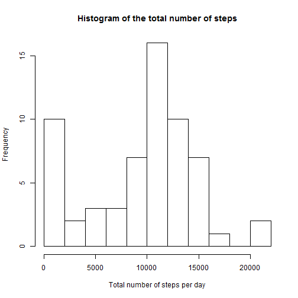
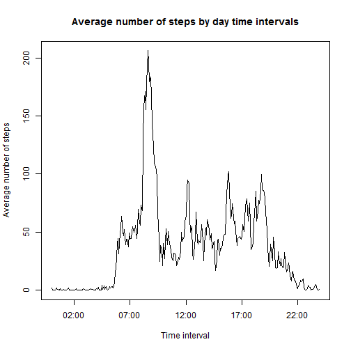
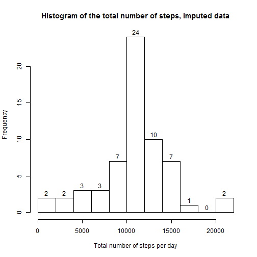
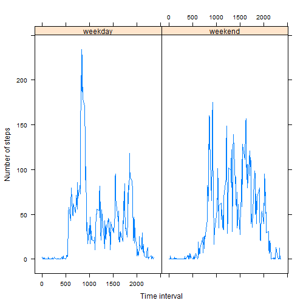

#Report on activity monitoring data

##Data

```r
setwd("~/R")
activity <- read.csv("activity.csv")
nobs <- nrow(activity)
```

Data on activity monitoring contain 17568 observations with:

* number of steps taking in a 5-minute interval (in variable step)
* the date on which the measurement was taken in YYYY-MM-DD format (in variable date)
* identifier for the 5-minute interval in which measurement was taken (in variable interval)

###Mean total number of steps per day

```r
dates <- as.vector(unique(activity$date))
mysplit <- split(activity, activity$date)
act.day <- data.frame(date = character(), steps = numeric(), stringsAsFactors = TRUE)

for (i in dates) {
  datei <- mysplit[[i]]
  stepsi <- sum(datei$steps, na.rm=TRUE)
  act.day <- rbind( act.day, data.frame(date = i, steps = stepsi, stringsAsFactors = TRUE))
}
```

###Histogram of the total number of steps per day


```r
hist(act.day$steps, breaks=10, xlab="Total number of steps per day", main="Histogram of the total number of steps")
```

 

###Mean and median of the total number of steps taken per day 


```r
act.day.mean <- mean(act.day$steps, na.rm=TRUE)
act.day.median <- median(act.day$steps, na.rm=TRUE)
```

Mean: 9354.2295082

Median:10395

## Average daily activity pattern


```r
intervals <- unique(activity$interval)
mysplit1 <- split(activity, activity$interval)
act.int <- data.frame(interval = numeric(), avsteps = numeric())

for (i in intervals) {
  inti <- mysplit1[[as.character(i)]]
  avstepsi <- mean(inti$steps, na.rm=TRUE) 
  act.int <- rbind( act.int, data.frame(interval = i, avsteps = avstepsi))
}

plot(strptime(sprintf("%04d", act.int$interval), format="%H%M"), act.int$avsteps, type="l", xlab="Time interval", ylab = "Average number of steps", main="Average number of steps by day time intervals")
```

 

### Time interval with max number of steps


```r
maxi <- which.max(act.int$avsteps)

##max.int <- strptime(sprintf("%04d", act.int$interval[maxi]), format="%H%M"))

max.int <- act.int$interval[maxi]
max.avsteps <- act.int$avsteps[maxi]
```

Interval: 835

Max average number of steps per day: 206.1698113

##Imputig missing values 


```r
vmis <- activity$steps[activity$steps=="NA"]
nmis <- length(vmis)
```
Number of missing values: 2304

###Histogram of the total number of steps per day, data with imputed values


```r
act.imp <- data.frame(date = character(), interval = numeric(), steps = numeric(), stepsimp = numeric(), stringsAsFactors = TRUE)

for (i in 1: nrow(activity)) {
  if ( is.na(activity$steps[i])) {
    impi <- act.int$avsteps[act.int$interval==activity$interval[i]]
    act.imp <- rbind( act.imp, data.frame(date = activity$date[i], interval = activity$interval[i], steps = activity$steps[i], stepsimp = impi, stringsAsFactors = TRUE))
  }
  else {
    act.imp <- rbind( act.imp, data.frame(date = activity$date[i], interval = activity$interval[i], steps = activity$steps[i], stepsimp = activity$steps[i], stringsAsFactors = TRUE))
  }  
}

mysplit2 <- split(act.imp, act.imp$date)
act.imp.day <- data.frame(date = character(), steps = numeric(), stringsAsFactors = TRUE)

for (i in dates) {
  datei <- mysplit2[[i]]
  stepsi <- sum(datei$stepsimp, na.rm=TRUE)
  act.imp.day <- rbind( act.imp.day, data.frame(date = i, steps = stepsi, stringsAsFactors = TRUE))
}

hist(act.imp.day$steps, breaks=10, labels=TRUE,xlab="Total number of steps per day", main="Histogram of the total number of steps, imputed data")
```

 

###Mean and median of the total number of steps taken per day, imputed data


```r
act.imp.day.mean <- mean(act.imp.day$steps)
act.imp.day.median <- median(act.imp.day$steps)
```

Mean: 1.0766189 &times; 10<sup>4</sup>

Median: 1.0766189 &times; 10<sup>4</sup>

###t-test for difference of original data with imputed data


```r
t.test(act.day$steps, act.imp.day$steps)
```

```
## 
## 	Welch Two Sample t-test
## 
## data:  act.day$steps and act.imp.day$steps
## t = -1.6436, df = 110.196, p-value = 0.1031
## alternative hypothesis: true difference in means is not equal to 0
## 95 percent confidence interval:
##  -3114.4271   290.5088
## sample estimates:
## mean of x mean of y 
##   9354.23  10766.19
```

## Activity pattern for weekdays and weekends


```r
act.impwk <- data.frame(date = character(), weekd = character(), interval = numeric(), steps = numeric(), stepsimp = numeric(), stringsAsFactors = TRUE)

for (i in 1: nrow(act.imp)) {
  cdate <- as.Date(act.imp$date[i])
  if ( weekdays(cdate) == "Saturday" | weekdays(cdate) == "Sunday" ) {
    act.impwk <- rbind( act.impwk, data.frame(date = act.imp$date[i], weekd = "weekend", interval = act.imp$interval[i], steps = act.imp$steps[i], stepsimp = act.imp$stepsimp[i], stringsAsFactors = TRUE))
  }
  else {
    act.impwk <- rbind( act.impwk, data.frame(date = act.imp$date[i], weekd = "weekday", interval = act.imp$interval[i], steps = act.imp$steps[i], stepsimp = act.imp$stepsimp[i], stringsAsFactors = TRUE))
  }
}
```

###Plot by average number of steps for weekdays and weekends


```r
mysplit3 <- split(act.impwk, act.impwk$interval)
act.int.weekd <- data.frame(interval = numeric(), avsteps = numeric(), weekd=character())

for (i in intervals) {
  inti <- mysplit3[[as.character(i)]]
  avstepsiwd <- mean(inti$steps[inti$weekd=="weekday"], na.rm=TRUE) 
  act.int.weekd <- rbind( act.int.weekd, data.frame(interval = i, avsteps = avstepsiwd, weekd= "weekday"))
  avstepsiw <- mean(inti$steps[inti$weekd=="weekend"], na.rm=TRUE) 
  act.int.weekd <- rbind( act.int.weekd, data.frame(interval = i, avsteps = avstepsiw, weekd = "weekend"))
}

library(lattice) 
attach(act.int.weekd)
```

```
## The following objects are masked from act.int.weekd (pos = 4):
## 
##     avsteps, interval, weekd
## 
## The following objects are masked from act.int.weekd (pos = 5):
## 
##     avsteps, interval, weekd
## 
## The following objects are masked from act.int.weekd (pos = 6):
## 
##     avsteps, interval, weekd
```

```r
xyplot(act.int.weekd$avsteps~act.int.weekd$interval|act.int.weekd$weekd, main="", ylab="Number of steps", xlab="Time interval", type = "l")
```

 

